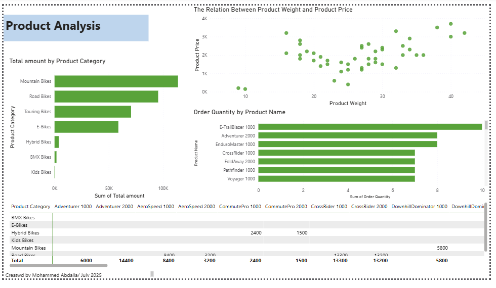
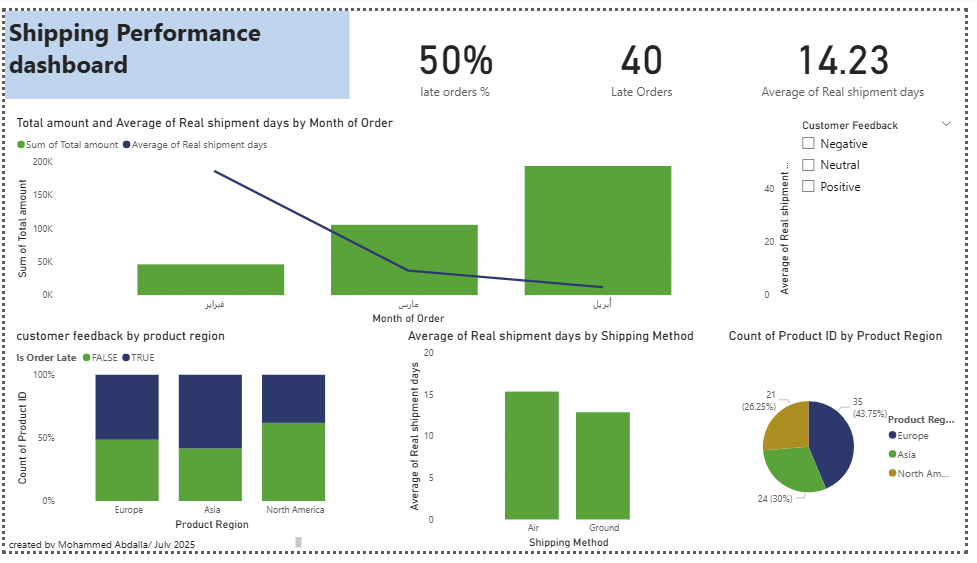
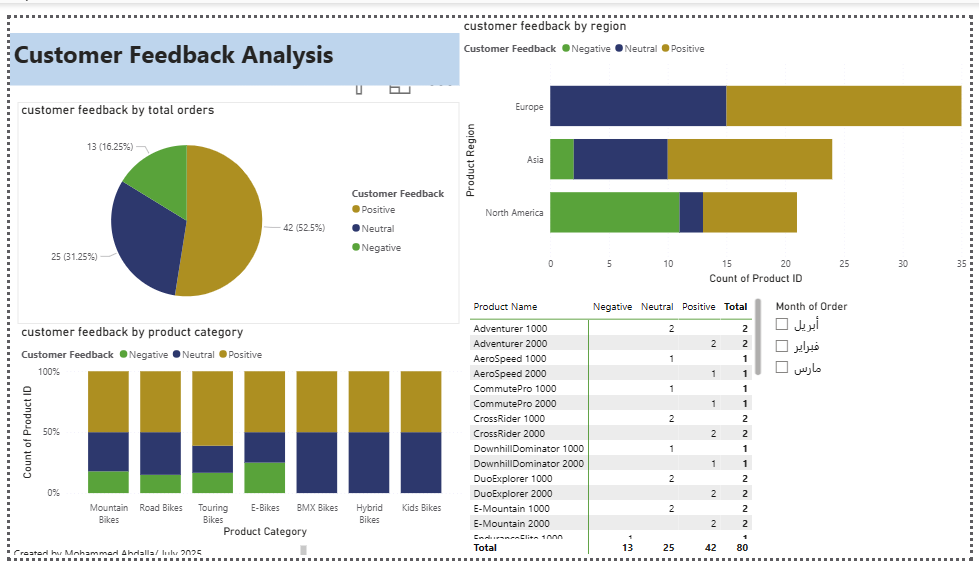

# 📦 Shipping & Customer Feedback Analysis Dashboard

This Power BI project analyzes shipping performance and customer feedback across different product regions, shipping methods, and time periods. The dashboard provides insights that help identify logistics bottlenecks and customer dissatisfaction patterns.

---

## 📁 File Contents

- Shipping_Project.pbix: The full Power BI report file

---

## 🧰 Tools Used

- Power BI Desktop
- Power Query
- DAX
- Excel (data source)

---

## 📊 Report Pages

1. Dashboard Overview – Summary KPIs and performance indicators
2. Products Analysis – Sales by product, region, and feedback
3. Shipping Analysis – Shipment delays, average delivery days, regional performance
4. Customer Feedback – Positive vs. negative sentiment by region and shipping method

---

## 🔍 Key Insights

- 💰 Europe recorded the highest total sales among all regions.
- 📈 Sales increased steadily from February to April, indicating seasonal or marketing-driven growth.
- ⚖️ A positive correlation was observed between product price and product weight.
- 🚚 As real shipment days decreased, total sales increased — suggesting improved logistics performance.
- 😟 North America had the highest share of negative customer feedback.
- 📊 16.25% of total orders received negative feedback.
- 📦 Shipping Method B had the highest percentage of negative feedback, suggesting performance issues.
- 🌎 A significant 85% of all negative feedback came from North America, indicating a strong regional dissatisfaction that may require service-level improvements.

---

## 🖼️ Preview (optional screenshots)

*report pages screenshots:*
### Overview Page

 ### Products Analysis

 ### Shipping Performance

### Customer Feedback

---

## 🙋‍♂️ Author

Mohammed Abdalla.  
📅 July 2025  
🔗 [LinkedIn Profile](www.linkedin.com/in/
mohammed-abdalla-526153318
)

---

## 📌 Tags

#PowerBI #DataAnalytics #CustomerFeedback #ShippingDashboard #DAX #DataVisualization #PortfolioProject

